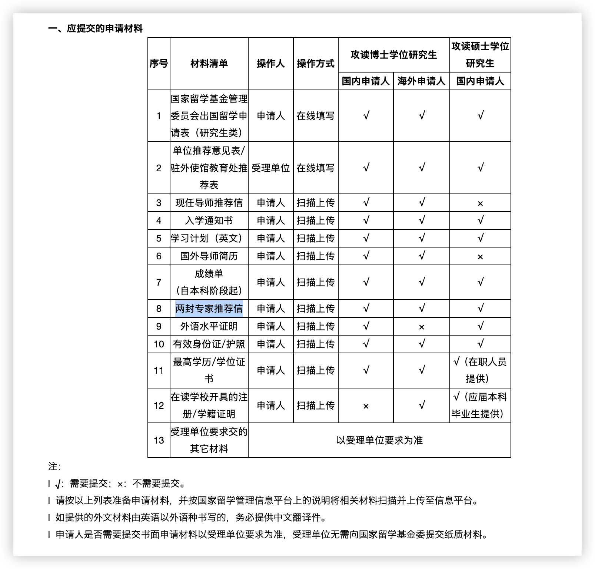
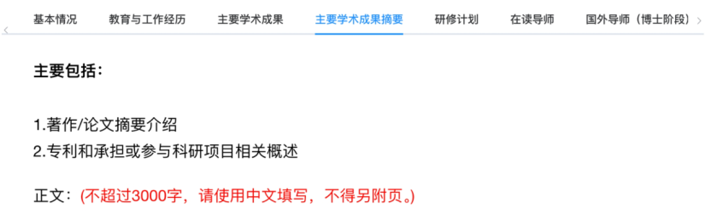
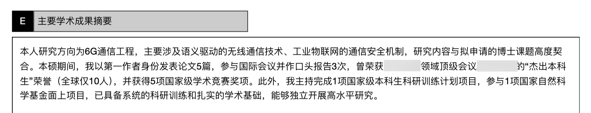
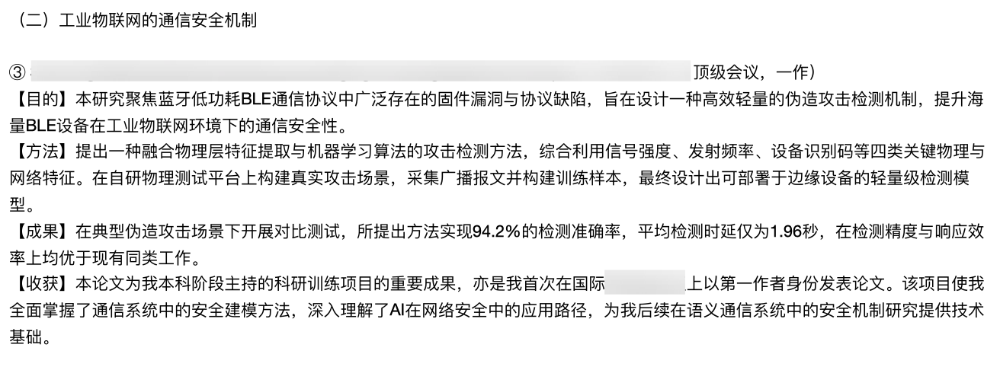
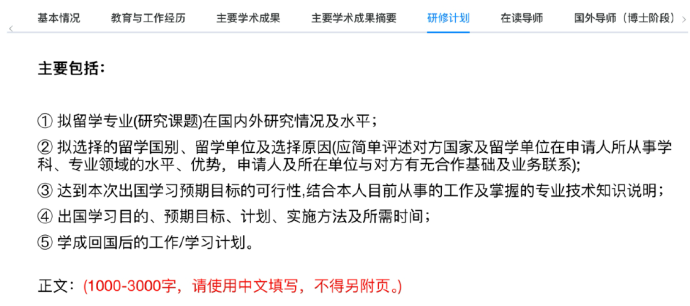
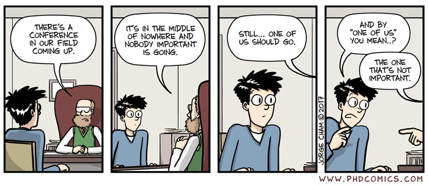
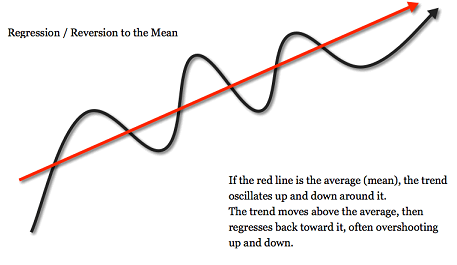
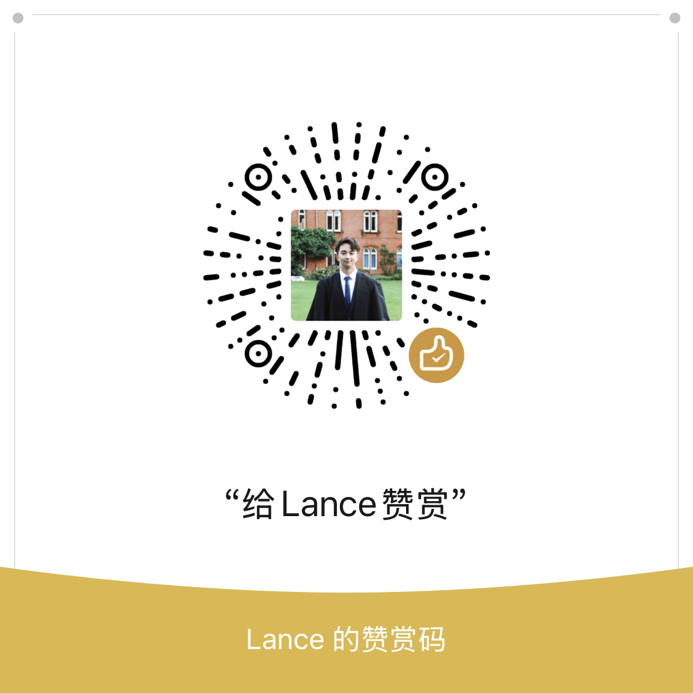

## 剑桥CSC国家公派奖学金申请指南

> **申请哲学：好好努力，心平气和，静候佳音**
>
> 更新时间：2025.07.03

### 前情提要

笔者在2025秋季入学的申请季中，拿到了剑桥大学工程系的博士offer，并有幸获得了Cambridge CSC Scholarship，也即中国国家留学基金委和剑桥大学的合作奖学金。该奖项覆盖了全额的博士学费、每年20780英镑的生活费、以及一份来回的经济舱机票，需要获奖者在PhD毕业或Postdoc工作结束后，回国服务两年时间。

 剑桥CSC和牛津CSC是留学基金委合作渠道所提供的数额最大、同时也最竞争的奖学金，不同于其他学校的是，牛剑CSC都不需要获得学校的提名，而是需要申请人首先获得学校的offer，然后在每年的三月底前提交申请材料。从剑桥近三年的数据来看——每年大概会有200名左右的offer holder提交材料，并有大约100人进入面试环节，最终有约20名同学直接获得奖学金，同时会有约6名同学被提名为备选（需要排名靠前的同学放弃，才能顺位下延获得奖学金）

 其实网上已有很多CSC相关的申请攻略，但质量参差不齐，专注于牛剑CSC的有效信息更是少之又少。并且，信息也会随着时间推移而逐渐过期，因此三年前的数据基本上都不再适用。同时，网上很多帖子认为CSC申请基本上是“玄学”、“关系户”专场。大都是不完全正确的。

 笔者认为，看似随机性、主观性极强的CSC申请，并非无从下手。本文将从前期准备、材料撰写、面试技巧等三大方面，逐步拆解公派申请过程，给大家提供一些思路，希望可以帮到后来的学弟学妹们。

 注意本文主要针对的是CSC国家公派申请，如果需要了解学校本身提供的海外全奖，可以移步笔者的另一篇帖子。

---

### 第一章：前期准备

> 本章节包括：
>
> 1.1 时间线
>
> 1.2 背景要求
>
> 1.3 前期建议

#### 1.1 时间线

首先如上所述，剑桥和牛津的CSC公派奖学金，和其他学校不同的是，并不需要任何提名。申请人需要先自行申请，拿到学校的有条件录取，也就是conditional offer，然后在3月底的deadline前单独向CSC提交申请材料。

 需要注意的是，conditional offer这里允许的条件有限：可以是待提交的ATAS审查结果，可以是待提交的本/硕毕业证；但**绝对不能**是语言成绩（雅思托福），在申请牛剑的国家公派奖学金之前，必须完成语言方面的要求，否则极大概率第一轮直接被刷。笔者观察近三年的情况，无一例外。

 关于时间线，笔者2025年申请的时间节点大致如下：

- 2024年12月初，提交剑桥PhD申请
- 2025年2月初，拿到工程系PhD conditional offer（语言条件已通过）
- 2025年3月底，提交CSC申请材料
- 2025年4月21号，收到CSC面试邀请
- 2025年4月25号，CSC面试测试
- 2025年4月26号，CSC正式面试
- 2025年5月29号，CSC中奖结果 🎉

---

#### 1.2 背景要求

接下来，笔者将从主观视角，聊聊牛剑CSC申请对于申请人背景上要求，以及申请人可以从哪些方面做出努力，来提升自己的竞争力。

 首先说明笔者自己的背景情况：笔者本科就读于国内211的中外合办项目，有两个本科学位，硕士在剑桥工程系读的研究型MPhil，硕导同时也是未来的博导，因此研究具有很强的一致性和连贯性。在25年3月申请CSC时候，笔者和博导已经有1篇会议中稿，1篇期刊在投。另外笔者本科期间有2篇领域top会议文章，以及一项比较有含金量的会议学术奖项。

 接下来，谈谈牛剑CSC申请最重要的几份材料（关于这些材料如何撰写，文本会在后续说明）：

- 研修计划（3000字）：最重要的材料，展现申请人对于研究的理解，以及研究本身对于国家的意义；
- 主要学术成果摘要（3000字）：展现申请人的背景，是否能够胜任所提出的研究，是否有能力按照计划完成研究内容；
- 博士阶段导师介绍：展现申请导师的优势，是否领先于国内，是否在国际学术的一流水平；
- 申请人成绩单、博士导师推荐信、两封专家推荐信等等其他材料。

笔者主观地认为，CSC申请材料的重要性大概占比7成，其中最重要的三点分别是：

- （1）申请人是否足够优秀，背景相对于其他申请者是否脱引而出；
- （2）研修计划是否可行，是否贴合国家未来十年的发展需求；
- （3）申请的导师是否处于国际顶尖，是否具有很高的学术话语权。

其次，CSC面试的重要性占比3成。基于所提交的材料，面试官更想进一步确认三点：

- （1）申请者是否足够了解自己的研究内容；
- （2）申请人的英文水平是否足够好；
- （3）申请人在短时间内所展现出的个人品质（比如随机应变能力、抗压能力、回国的驱动力等等）

 CSC申请本身是非常主观的，985本硕背景当然是加分项，大子刊的发表当然非常吸睛。但是成功与否，更取决于你是否呈现出了一份有理有据、打磨精致的研修计划；以及你未来的导师是否在国内知名（比如IEEE/ACM Fellow，国家院士，知名期刊主编等等）而这些，都是我们在前期准备的时候，能够着重提升的地方。

 笔者基于2025年剑桥CSC中奖者的情况来看，导师的背景往往起到至关重要的影响。笔者的一位朋友在无论文、绩点平平、本科学校级别普通，这样的背景下依旧拿到了奖学金。他个人也认为最大的影响，是因为他选择的导师是IEEE Fellow、该领域的top学者。

 

---

#### 1.3 前期建议

综上，从申请奖学金的角度考虑，笔者希望给目前处于前期准备的同学几点建议：

- **（1）选择合适的导师，最为重要**——title更高的导师，当然更容易拉到funding，也更有话语权为你争取学校本身的国际生奖学金。于此同时，导师的高知名度对于你申请国家公派，也能够起到非常大的加分作用。此外，如果你选择的导师暂时处于起步阶段，并且ta没办法为你找到企业赞助的funding，并希望你去申请国家公派（这种情况很常见），这个时候你可以和导师商量，能不能为你匹配一个title和知名度都更高的二导，在你申请CSC的时候标注出你的二导，这样也更有利于你的申请； 

- **（2）选择合适的课题，非常重要**——国家公派花的是纳税人的钱，当然希望被资助者能够尽早回国、报效社会。因此，国家短期十年内需求较大的研究方向，获得资助的概率自然大得多。申请者需要详细阅读国家相关政策文件（比如[国自然基金的优先资助领域](https://www.nsfc.gov.cn/publish/portal0/tab1392/info87786.htm)），从而了解哪些学科的哪些研究议题，是国家重点关注且需要的； 

- **（3）尽早发表优质文章，丰富申请材料**——CSC申请文件中，最重要的莫过于「研修计划」和「个人成果摘要」，此外，申请表中还有一个栏目需要填写四篇自己的代表作。这里的代表作必须是已经被接收的文章，最好是SCI或EI检索，并且自己是主要作者。因此在投、在审的文章能够提供的支持很有限，建议在申请前至少有1篇领域认可的第一作者文章。同时尽早开始相关材料的撰写，不要等到最后两个礼拜了才开始写。至少留足一个礼拜的时间来打磨润色； 

- **（4）把握规则，关注最新文件**——这里也是笔者自认做得最好的一点，提前一年就开始关注CSC博士申请，对各项规则稔熟于心，同时和多位中奖的师兄师姐保持密切联系，以便了解最新资讯和相关技巧。此外，每年都有学生把剑桥CSC的「合作渠道」错选为「个人渠道」，导致最后即使在「个人渠道」拿到大红奖状，但是因为学校不给开免学费而失去机会（牛津剑桥几乎不可能给海外生免学费，CSC基本只能走合作渠道）。因此，把握规则，消除信息差，将让你在第一步领先于竞争者。 

- **（5）扬长避短，掌握学术修饰**——这一点恐怕有些读者会不认可。但世界不是非黑即白的，学术包装不等于学术造假，扬长避短也并非夸大其词。学会在合理、合适的场景下，突出自己的优势，也是学术素养的一部分。比如，笔者的本科学校背景并不出众，但笔者是该校近二十年来第一位获得剑桥录取的毕业生，这一点就是笔者在面试可以强调的，最后也自然得到了面试官的认可。这种思路供大家参考，切记要在合适的语境下使用。 

以上是第一章（前期准备）的所有内容。下一章，笔者将重点关注CSC系统材料的撰写技巧。

  

---

### 第二章：材料撰写

> 本章节包括：
>
> 2.1 材料要求
>
> 2.2 主要学术成果撰写技巧
>
> 2.3 研修计划撰写技巧
>
> 2.4 CSC其他材料的普适建议

#### 2.1 材料要求

上一章笔者详细介绍了「前期准备」的内容和技巧，在这一章，笔者将专注于牛剑CSC公派申请的「材料要求和撰写技巧」。在这里，笔者不会花太多篇幅来解释到底需要交哪些材料，这些内容应该是由读者自行去CSC官网搜索并理解的。这个链接[🔗2025年国家留学基金委剑桥奖学金](https://www.csc.edu.cn/chuguo/s/3665)，供大家参考。

 需要注意的是，具体的政策文件每年都有可能微调，大家务必提前2-3个月开始关注最新文件的发布，并仔细阅读相关条例。建议多和其他申请者沟通，不要闭塞自己的消息渠道，往往通力合作更有可能共同进步（笔者25年和两位朋友一同准备，相互反馈，模拟面试，最后三个人都很幸运地中奖了）当然，如果你希望和笔者一起准备材料和面试，也欢迎联系。

 好了言归正传，以2025年剑桥CSC为例，需要提交的所有材料[如图所示](https://www.csc.edu.cn/article/3668)：

 

 其中，最为重要的是**《1、国家留学基金管理委员会出国留学申请表》**。这个在线申请表就是填写「研修计划」和「主要学术成果摘要」等文书材料的地方，需要认真打磨好每一个栏目里面填写的文本，做到把个人优势尽可能完整、高效、真诚、丰满地呈现出来。

 至于**《2、单位推荐意见表/驻外使馆教育处推荐表》**。这个材料是完全由受理单位来填写的，比如笔者是剑桥硕士申请剑桥博士，那么受理单位就是中国驻英国使馆；如果申请人是清华大学的学生，受理单位自然就是清华大学。这里会出现问题的一般是在职的申请人，需要注意你的在职单位是否有资格给你提供推荐。

 需要注意的还有**《8、两封专家推荐信》**。一般建议是提交国内专家的中文版本推荐信。毕竟CSC的评委很大概率是中年学者，看英文可能会比较吃力，作为申请人要做的应该是考虑如何减轻审稿人的负担，减少信息差。

 其他的材料就非常简单易懂了，建议大家提前一个月准备好相关文件。此外，务必注意你所选择的项目必须是「合作渠道」，而不是个人渠道，这一点每年都有同学弄错，切记多加检查，不要让自己的努力付诸东流。

 接下来，笔者将呈现文本中最为重要的部分——**CSC材料的撰写技巧**。

---

#### 2.2 「主要学术成果摘要」撰写技巧

 

 总体来说，主要学术成果摘要的核心目的，就是为了向评委证明，申请人有能力完成未来的学业和项目，凸显自己的个人实力，并展现出自己相对于同期竞争者的独特优势。笔者这里给大家提供几点重要建议：

- **首先，开头一定要有总结性的摘要**。这其实和写paper是一个道理，讲究一个“虎头豹尾”。开头，就要向评审专家们亮出自己的肌肉（发表过xx篇1区2区论文，参加过xxx大项目，拿过xxx大奖），给专家们留下深刻的印象，最好是达到这种效果：专家看完这一段，ok👏，已经了然于胸了，这个学生挺牛逼，后面不用就细看了，只需要稍微确认一下就好。这样就是一个成功的「摘要之摘要」。 
  - 英国CSC这么竞争的情况下，有一定成果才更容易中奖。这也是为什么笔者之前写下建议，**尽早产出优质文章**。哪怕不是顶级期刊/会议，也没有关系，最重要的是要有话可讲，并且有证据可言。 
- **其次，文本的架构，一定要清晰、统一。**比如下面笔者会给大家提供当时采用的框架（四点描述法：目的+方法+成果+收获）供大家参考。这里的框架可以根据自己的背景来调整，本质上，都是为了让专家们，看得清晰，看得方便，同时也体现了自己清晰的写作逻辑能力。 
- 最后，其实除了学术论文之外，还可以写的是：全国性的学科竞赛、主持参与过的科研项目等等。只要是能够证明自己能力的学术活动，在合适的语境下，都可以写进成果摘要。特别是针对论文成果相对较少的同学，可以尝试在自己的履历中挖掘出闪光点，并合理的描述展示。 

**对于「学术成果摘要」，笔者个人当时采用的撰写框架如下：**

- 摘要
- 研究方向（一）
  - ① 论文成果（SCI/EI，x区，领域顶级期刊，第一作者）
    - 【目的】
    - 【方法】
    - 【成果】
    - 【收获】
  - ② 论文成果
- 研究方向（二）
  - ③ 论文成果
  - ④ 论文成果
  - ⑤ 竞赛成果
- 其他发表和获奖情况

因为笔者在本硕期间的研究方向略有不同，但都在同一个大背景下，因此笔者划分了两个章节来写。但其实无论用什么框架来撰写成果，都要在文本中时刻点题——**最终都是为了服务自己未来的研究，在过程中学到了xxx知识，培养了xxx技术，产出了xxx结果**——证明了自己有能力完成博士课题。

 这里提供笔者当时写的「概括性摘要」，供大家参考：

 

 最后，关于论文成果的「四点描述法」，这里提供笔者的文本示例：

 

---

#### 2.3 「研修计划」撰写技巧

 

 研修计划是整个CSC申请中最为重要，同时也公认最难写的一个材料。网上对于研修计划怎么写这个话题已经有太多文章（大家可以在小红书搜到很多优质的内容），因此笔者不会关注于说明每一个章节需要撰写什么内容，而是提供一种思路，教大家如何拔高自己的材料，从而让审稿人信服，愿意打高分。

** 对于「研修计划」，笔者个人采用的撰写框架是：**

- 标题（一行即可）
- 1、研究课题在国内外研究情况及⽔平
- 2、拟选择的留学国别单位及原因
- 3、可⾏性分析
- 4 、出国学习⽬的、预期⽬标、计划、实施⽅法及所需时间
  - 4.1 出国学习⽬的
  - 4.2 核心目标
  - 4.3 具体规划
- 5、学成归国后的生涯规划

下面，笔者将按照顺序给大家提供一些思路：

- **首先关于「主题」**，研修计划的主题一定要符合国家政策导向，强烈建议大家深入阅读国家自然科学基金委的“十四五”发展规划，特别是其中的「[第十一章 学科发展战略](https://www.nsfc.gov.cn/publish/portal0/tab1392/info87785.htm)」以及「[第十二章 优先发展领域](https://www.nsfc.gov.cn/publish/portal0/tab1392/info87786.htm)」，里面包含了理工文商各个学科的重点投入领域，我们可以从中窥探出哪些课题是国家需要的，哪些课题是专家喜欢的。因为评审专家们同样需要详细理解这些规则，来申请他们的科研经费，因此“国自然发展规划”可谓是中国版的科研圣经，强烈建议大家深入阅读，并以此为基础来微调自己的课题。比如说笔者的主题是“⾯向空天地海⼀体化⽹络的语义通信系统”，其中几乎每一个名词，都可以在“规划”中找到强相关的内容，这就是命题的巧思。
    
- **「1、国内外水平」**，第一个章节的写法其实和论文的introduction很像，都是Literature Review + Research Gaps + Our Contributions。很多人说一定要写国内差外国好，其实不然，现在绝大多数领域国内都不弱，尤其是结合AI的交叉学科，国内的发文量甚至远超国外。并不一定要显式突出「外强内弱」，也可以采用「侧重点」不同这个思路，比如笔者在文中所写：“*相较之下，欧美⾼校更侧重于语义通信研究的实际应⽤⽅向*”。  
- **「2、拟选择的留学国别单位及原因」**，这里是最好写的，无非就是展示肌肉，但重要的是找到自己博士平台的亮点，语言要具体而有力。比如：“*在⽆线通信领域，剑桥拥有13位IEEE会⼠，科研实⼒强劲，是通信学科⾼层次⼈才的重要培养基地。*”。可以面向“学校、导师、团队” 这三点分别来写，突出**学校平台高、导师实力强、团队基础好**。  
- **「3、可行性分析」**，这里网上很多帖子都是单纯分析个人基础和科研潜力，其实这样写，可展示的信息量很少。大家可以考虑笔者的创新写法，从这三个角度来写：**（1）人员可行性**，说明的是自己实力强，本硕研究和博士研究高度一致，具备很好的人员可行性；**（2）理论可行性**，说明所研究的课题在导师课题组已经有一定的研究基础，初步验证过方法论的可行性，具备很好的理论可行性；**（3）技术可行性**，实验室具备顶尖的实验器材，具备丰富的实验数据集，建立了完善的博士培养体系，具备很强的技术可行性。  
- **「4、出国学习⽬的、预期⽬标、计划、实施⽅法及所需时间」**，这里笔者分为了**（1）学习目的（2）核心目标（3）具体规划**，这三个部分来写。具体而言，「学习目的」说明课题打算做到什么程度，出国读博打算要到什么东西。「核心目标」则是要量化的指标，需要清晰明确，达到什么效果，发表什么文章，推进什么事业。最后的「具体规划」可以理解为按照时间阶段来划分的research proposal，一般是层层递进，突出时间上合理的安排，让专家觉得这个计划是可实现的。  
- **「5、学成归国后的生涯规划」**，其实笔者在这里只写了一句话，“*回国后计划进⼊⾼校或研究所⼯作，填补语义通信研究在应⽤层⾯的空⽩，深化剑桥与国内的合作交流，为⼈才培养和科技发展贡献⼒量*”。也正因这里只写了一句，面试的时候果然就被问了「回来后的计划」这个问题，笔者事先考虑到了这种可能性，因此做了非常充分的准备。这里笔者的理解是，其实生涯规划的是若干年后，其实很依赖于博士期间的产出，才会知道自己以后是留在学界还是去业界。因此这里控制在80-100字以内为宜，言简意赅。  
- **以上共计六点。大家需要思考：如何把每一个得分项都拿满，不要过于专注某一章节，而导致其他章节失去空间；也不要平铺直叙、缺乏重点。  **
- 于此同时，排版上也需要注意，适当地使用空行，适当牺牲空间来换排版的美观。多找几位更资深的老师或朋友来帮你审核把关，从避免逻辑错误和内容错误（毕竟自己看自己的内容，往往很难发现错误，因为“默认正确”）。最后，使用GPT来润色一下语言也很有效，笔者当时使用GPT-4o几乎把文本重修了一遍，最后语言确实严谨了很多。 

希望这些建议对大家有所帮助，最重要的还是找到最适合自己背景的写法，多多尝试润色，多方咨询反馈，相信你也可以写出中奖计划！ 

---

#### 2.4 「其他材料」的普适建议

上面讲完了两大重点，现在让我们重新回到《1、国家留学基金管理委员会出国留学申请表》其他部分的内容，这个申请表2025年的版本包括以下栏目：

- （A）基本信息
- （B）申请留学单位
- （C）教育与⼯作经历
- （D）主要学术成果
- （E）主要学术成果摘要 ⬆️
- （F）研修计划 ⬆️
- （G）在读导师（目前阶段）
- （H）国外导师（博⼠阶段）
- （I）承诺书
- 单位推荐意见表

其中（A B C）基本上不会有什么问题，确保自己信息填写正确即可。（D）这里可以关注的是，一定要具体高效地呈现出自己的优势内容。比如论文的「收录情况」，可以标注出SCI、EI、中科院一区、CCF-A类等领域认可的索引方式；再比如科研项目的「排名及职责」，除了填写主持、参与之外，还可以括弧，说明自己的具体任务（项目申请、实验验证、论文撰写与发表等）。

 接下来，（G H）这里我们需要关注的是，如何尽可能地体现出导师和课题组的优势。这里给大家提供一些相关文本思路：

- A教授已培养博⼠21名和硕⼠⽣37名，其中包括3名中国籍博⼠和5名中国籍硕⼠；
- A教授在基于⼈⼯智能的⽆线通信、纳⽶尺度的⽹络通信等科研⽅向具有深厚造诣，并因此获得IEEE Fellow的殊荣；
- A教授近5年来在IEEE和爱思唯尔旗下的国际顶级期刊上发表了50余篇⾼影响⼒论⽂。A教授的论⽂总引⽤次数已超过16000次，h因⼦为63；
- 在国内，他与浙江大学H教授，哈尔滨工业大学P、M等教授保持长期学术交流与合作，其专著亦由P教授翻译出版中文版。这些紧密的合作关系不仅体现了A教授的国际影响力，也为推动全球通信领域的发展作出了重要贡献。

**到这里，笔者已经把最重要的《1、申请表》讲解完毕。**至于其他作为PDF上传的材料，这里给大家提供几点普适的建议：

- 务必确保所有信息都正确，不要缺页，不要过期，不要使用缺少印章的证明性文件。 

- 作为申请人，第一要义应该是考虑如何减轻审稿人的负担，减少你所要传递信息的「信息差」，在你撰写材料和提交材料的时候，都要考虑到如何让审稿人用最少的时间，掌握你最多的优势信息。 

- 对于《最高学历/学位证书》和《成绩单》这类需要放很多内容的PDF文件，笔者的个人建议是在首页加入一个清晰简单的目录，来说明哪一页是什么内容，这样可以方便审稿人阅读，留下更好的第一印象。不只是申请CSC，我们在很多日常场景下，都应该考虑做到这一点：**节省他人的时间，对自己亦有无穷裨益**。 

- 最后，对于《英文版本的学习计划》，其实大部分评委并不会花太多时间来看这些附件材料，并且考虑到很大一部分评委并不是在英文语境中完成的科研训练，因此英文学习计划并不是CSC申请的重点。笔者当时英文的学习计划，是直接沿用了申请剑桥PhD项目所提交的research proposal，只是在格式上做了一些调整来符合CSC要求（比如导师签名等）。因此这里不需要花太多功夫进行润色，最重要的还是中文版本的研修计划 

那么以上就是第二章（材料撰写）的所有内容。在下一章，笔者将重点关注英国CSC独特的「面试环节」，包括笔者自己的真实面经，准备过程，以及笔者**最干货的题库笔记**（超过15000字）。同时，如果你希望笔者帮你把关材料的撰写，以及进行面试模拟，也欢迎联系👉hc663@cam.ac.uk

 

---

### 第三章：面试技巧

> 本章节包括：
>
> 3.1 真实面经
>
> 3.2 面试准备方法
>
> 3.3 笔者的面试课题笔记
>
> 3.4 经验之谈

前面两个章节中，笔者讨论了CSC前期准备，和申请材料撰写相关的经验和建议。在本章节中，我们将关注于CSC申请中的面试环节。2025年开始，几所英国高校的CSC申请陆续开始需要面试环节，包括布里斯托、根特大学等（而剑桥、牛津、帝国理工是一直以来都需要面试）

#### 3.1 真实面经

首先是笔者在2025年剑桥CSC面试过程中被问到的4个问题：

1. 使用英文说一下你博士期间的研究计划
2. 说明一下你在CCF-A会议上发表的文章，做了什么工作，解决了什么问题？
3. 说明一下硕士期间，你和导师一起合作发表的文章，都做了什么？
4. 回国的问题，未来回国之后，打算如何发展？

笔者当时大致上的回答思路如下（四个问题笔者都提前准备到了）：

1. 针对第一个问题，关于Research Proposal，大概准备了1分30秒的

#### 3.2 面试准备方法

#### 3.3 面试题库笔记

#### 3.4 经验之谈

 

----

### 写在最后的话

笔者想说的是，公派中奖与否，实在有太多的主客观因素，很多时候我们付出了巨大努力却不一定换来好的结果。但是，不管是有没有中奖的同学们，都不要担心，因为人生往往是一个长期的均值回归，人生各个阶段的升学也好，求职也罢。都只是这条长达几十年的均值回归线上的一点点小噪音，你最后一定会和你的付出、能力和野心匹配上。所以我们大可不必为了一些短期的噪音而过多地焦虑。

 

 最后的最后，这篇文章应该是网络上大家可以找到的，关于英国CSC奖学金申请**最好的指导性文章**。笔者毫无保留地分享了自己申请博士、申请公派奖学金一年来所有的心得与经验，希望对大家有所帮助。祝大家顺利中奖！

 如果这篇文章帮到您，请考虑请笔者喝杯咖啡吧！谢谢 ☺️

 

