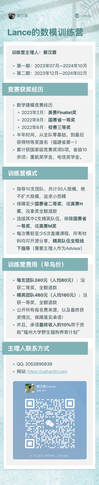

## Lance的数模训练营

> **训练营主理人：蔡汉霖**

### 关于主理人

- 三次数学建模竞赛经历
    - 2023年2月：**美赛Finalist奖**
    - 2022年9月：**国赛省一等奖**
    - 2022年6月：**校赛三等奖**
- 半年时间，从**全队零基础**，最后获得特等奖提名（**福建省所有高校中第一名**）
- 累计获国家级竞赛奖项5项，省级10余项

 

### 训练营模式

- 第一期国赛：2023年07月—2024年10月
- 第二期美赛：2023年12月—2024年02月
- 指导5支团队，共计15人规模，绝不扩大规模，追求小而精
- 保障至少**国赛省二等奖**，或**美赛H奖**，没拿奖全额退款
- 选拔其中2支精英队伍，保障**国赛省一等奖**，或**美赛M奖**
- 每次赛前至少5次直播课程，所有材料均可开源分享，**精英队伍全程线下指导**（美赛需要作为Advisor）

 

### 训练营价格

- **每支团队240元（人均80元）**；没获二等奖，全额退款
- **精英团队480元（人均160元）**；没获一等奖，全额退款
- 公开所有报名费来源，以及最终获奖情况，保障落实承诺！
- 承诺**最终收入的10%**用于资助“福州大学野生猫狗养育计划”

 

### 训练营海报

