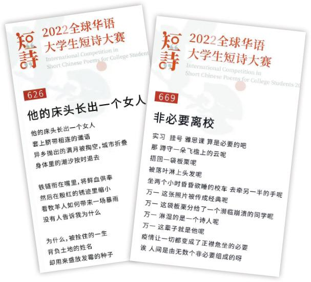

## 暂停、暂停、暂停！

> 本文写于2022年夏天，笔者结束了为期3个月的“禁止外出”

回到家里的感觉是很不一样的。七月底把学校里的琐碎收拾后，回到泉州，一下子整个人就松下来了。这种放松尤其集中在傍晚，坐在院子里慢悠悠地剥颗橙子，然后一瓣一瓣地吃掉。

 回头审视过去的半年，好像一直在到处奔跑，来不及冷静下来回顾上一份工作，人已经到下一场。持续奔走、毫无反思。这种状态可以理解为一种“三不五时”——傅博说的——“三时还做不完的事，五时却要去赶下一场的火车”。

---

 **暂停、暂停，**一方面指的是停下自己的脚步，在匆匆忙忙之间的间隙里找到一个平衡，反思过去一段时间自己又干了哪些蠢事。往往我们在忙碌里寻找意义，但其实慢下来才会发现——那些不一定都是意义。

 本科的第二年结束了。仰赖这两年来的一些运气，让我在假期里成为新生讲座上滔滔不绝的分享者。

 但站到台上后就会发现，绝大多数同学想听到的内容是什么——怎么成为内卷大环境中的赢家？——就连主办方给我们几位宣讲者定的主题大方向都是**“大家卷起来”**。

 

 当我们试图用一种更理想化，或是自欺欺人的方式来解读这种大环境的现象——也许是大多数人不想去区分“卷”和“奋斗”——但当你收到10条咨询，里面有8条都是如何取得高绩点、加入实验室、搞论文，云云。

 你会发现这种解读正是自我安慰，不是大多数人不会区分、不想去区分，而更大的可能是，这种路径已经内化为当下本科生们的“行为准则”与“终南捷径”。

> “既然我还有点迷茫，不知道该做些什么，那这条路准没错吧？”
>

我们怎么去拒绝他呢？他没错呀。

------

**暂停、暂停，**另一方面，指的是城市的暂停，在匆匆忙忙之间的戛然而止，无法考虑任何个体的运行。

 百货商场暂停了，学生街暂停了，连医院也暂停了。中学时候最爱的“台湾口口冰”、“M烫客”，暂停不下去，倒闭了。

 在墙内我们总是回避这些问题，不是我们不想谈，不是我们觉得没问题，当然有问题，**但!**

 **城市可以暂停吗？我不敢知道。**

 **我的时间可以暂停吗？我应该很敢知道。**

 我受够那些“打卡的枷锁”，把我们困在原地，即使我一场接一场地忙碌，试图让自己找一些意义。但我知道，这些意义始终在来回的境地。

 我受够那些“非必要的条例”，让年轻人们拈轻怕重、循规蹈矩。

> “城市的暂停，是为了更好的开启。”
>

那我们怎么去拒绝她呢？你敢吗？

---

 十年前的大学生们直到入学，都还不知道什么是985/211，但他们是大学生。

 而我猜，是不是正因一些的“暂停”，导致另一些的“无法暂停”？会不会是因为年轻人们只能局限在那方天地，导致内化出了这种路径、这套标准，这同样的结局。

 我不确信我猜的对不对，我只确信我的时间是不会停的。

 

 

> 话说回来，你会一瓣一瓣地吃橙子吗？
>
> 现在的你还爱吃橙子吗？
