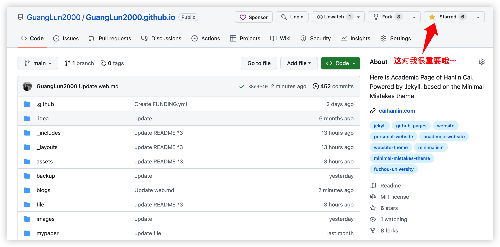
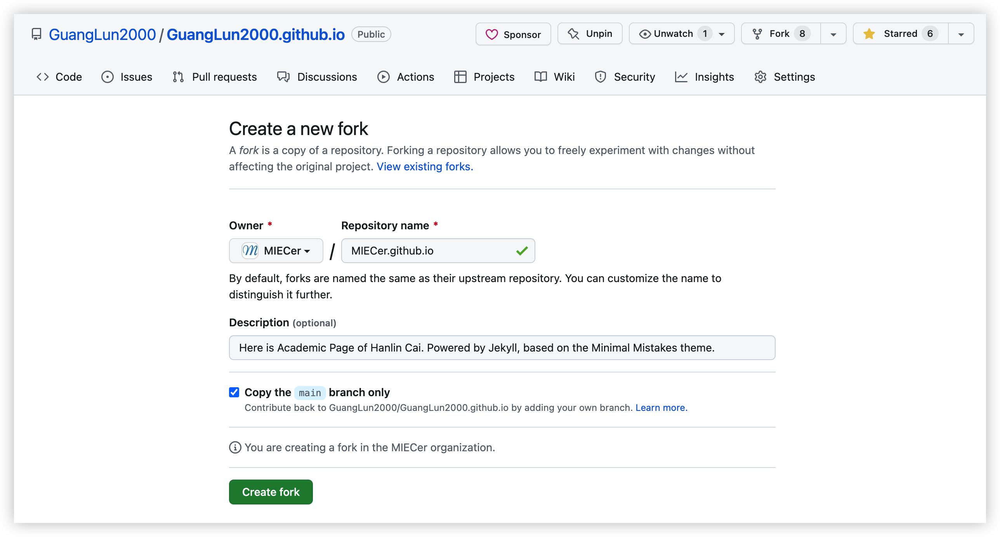
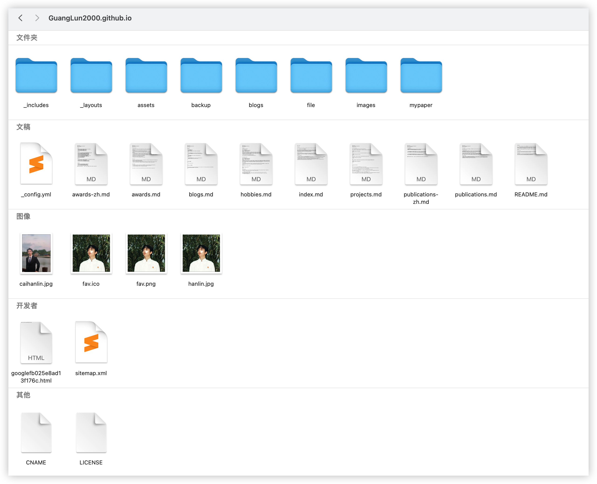
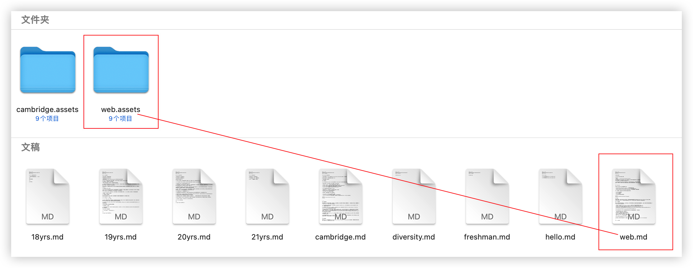
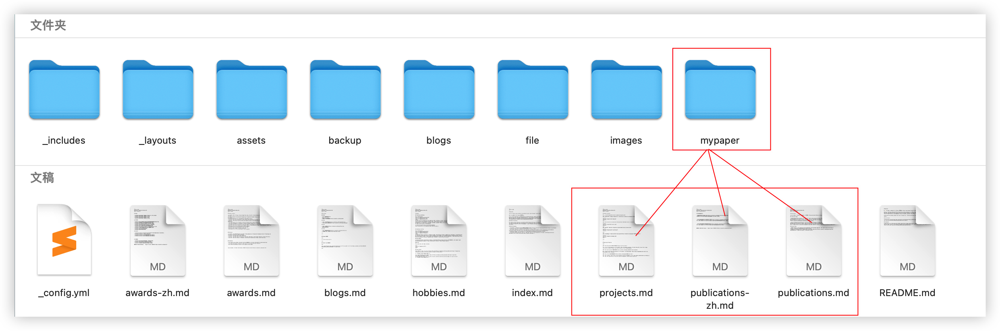
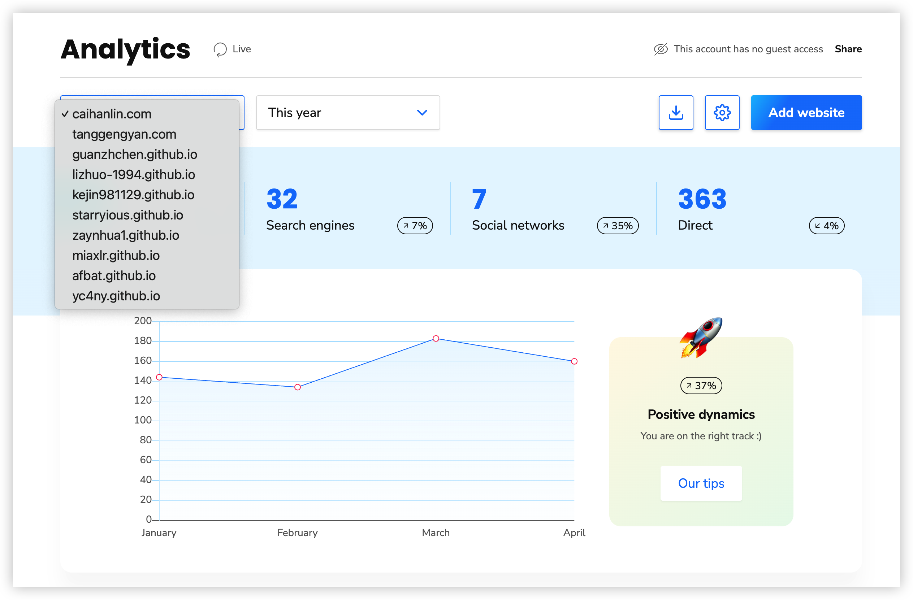

## 建站完全指南

> Philosophy：极简、高效、免费

<center>

</center>
<br>本站点自2022年12月正式发布以来，经历了2次重大修改，如今的单月访客量达到200多，在此感谢各位访客朋友的支持！与此同时，许多朋友也开始通过各种形式来咨询笔者——**如何搭建属于自己的轻量化主页？**

<br>刚开始还可以腾出时间仔细解答，但随着访客愈多，前来咨询的同学越来越多，然而笔者学业繁重，实在是应接不暇，非常抱歉！因此，为了方便各位朋友复刻本站点，笔者趁五一休假完成了这份小白建站完全指南，希望可以帮助读者朋友搭建一个**极简、高效、免费的Jekyll个人网站**。

---

### (0) 核心工具

在开始之前，首先介绍一下本站所依赖的核心工具

- [Jekyll](https://www.jekyll.com.cn/)：一个简单的静态网站生成器
- [Minimal Mistakes](https://mademistakes.com/)：本站所采用的极简风主题
- [Github Page](https://docs.github.com/zh/pages)：GitHub所提供的一个网页寄存服务

此外，本站配置了一些附加的小功能，调用第三方服务接口即可实现

- Calendly 线上聊天预约
- Disqus 站点留言功能
- Counter 访客记录
- Clustrmaps 访客分布动态地球仪

<center>

</center>

## 正文部分

能够看到这篇博客，说明你已经实现了**科学上网**，因此这里假设诸位读者朋友均可以正常访问[Github](https://github.com/GuangLun2000/GuangLun2000.github.io)，后续我们将采用最简单的**Github fork流程**进行指导，请确保你的每一步都准确按照流程。

### (1) 前期配置

接下来，我们先进行前期环境配置工作。**万事开头难**，读工科的同学都知道，往往配置代码编译环境是最繁琐的。一旦完成，后续的工作流将会非常顺滑，接下来请大家务必按照以下流程进行操作：

- 点击进入[Github官网](https://github.com/signup)，进行账号注册，建议使用非常用邮箱进行注册
- **可选项：**下载[Github Desktop](https://desktop.github.com/)，强烈建议小白下载，以减轻后续负担
- 关于Github Desktop如何使用，请参考[官方中文文档](https://docs.github.com/zh/desktop)
- 完成注册及下载后，请进入本站的代码仓库[GuangLun2000.github.io](https://github.com/GuangLun2000/GuangLun2000.github.io)

<br>

<br>完成上述前置工作后，接下来，我们来复制网站代码运行仓库，这也是最关键的步骤之一，请务必细心：

- ~~首先，点击右上角的Starred，为我助力~~
- **关键步骤：**点击右上角的Fork，进入配置界面
- Repository name配置为：[你的用户名].github.io
- **注意：**配置用户名和仓库名需要大小写一致！
- 勾选Copy the `main` branch only（只需要复制项目主支即可）
- 最后，点击Create fork，完成代码仓库复制

<br>

<br>到此为止，基本的工作已经完成一半了，如果在上面的步骤中出现了任何简单问题，请学会`STFW (Search The Friendly Web)`

---

### (2) 文件解释

下面，我们开始针对仓库内容进行定制化的修改。首先需要向各位解释，**根目录下各个文件的作用：**

```bash
.根目录
├── _config.yml  最关键的配置文件，所有的修改都将基于.yml展开
├── ***.md       主文件夹下的.md文件，构成了网站上的每一个界面
├── CNAME        用于配置个人域名，例如我的域名是caihanlin.com，而不是.github.io（可选配）
├── LICENSE      协议文件，MIT协议表示本代码仓库可以被免费、无偿地复刻（可选配）
├── sitemap.xml  实际上改不改这个文件，都不会影响网站的正常显示（可选配）
├── googlefb025e8ad13f176c.html        用于配置Google搜索（可选配）
```

<br>**然后，介绍一下各个“子文件夹”的功能作用：**

```bash
.根目录
├── _includes 构成本网站的html代码，不建议修改
├── _layouts  构成本网站的html代码，不建议修改
├── assets    美化本网站的css,less,js代码，不建议修改
├── backup    用于备份文件，以便于后续修改时可以参考
├── blogs     存放个人博客.md文件，以及对应的图片素材
├── file      存放简历CV等个人文件，用于设置访问链接
├── images    存放.jpg等媒体文件，用于设置访问链接
├── mypaper   存放个人学术文章，用于设置访问链接
```

<br>

---

### (3) 个性化修改

理解了每个文件对应的功能之后，再进行个性化的修改，就变得容易许多了。大家可以注意到，其实当你fork完代码仓库，等待一段时间后，访问 `[你的用户名].github.io` 这个域名，此时网站已经可以运行了，只不过显示的还是笔者的网站内容。

<br>因此，接下来需要进行个性化的修改。需要注意的是，在这里笔者并不会教大家，每个文件的具体配置——而是教你如何修改主要的文件，其他的则需要你自行按图索骥，举一反三。

<br>首先我们修改`index.md`文件，也就是网站的主界面，在文本编辑完成后，使用`Github Desktop`上传到你的`github仓库`，一切正常的话，1-2分钟过后，你的网站就会发生变化了。

<br>接下来，介绍`_config.yml`文件的配置方法，`.yml`是Jekyll静态站点的核心文件，核心的部分如下，其他的内容展示都先不用修改。笔者在`.yml`文件中已经撰写了比较详细的注释，如果还是不太清楚的话，建议`STFW (Search The Friendly Web)`

```yaml
title: Hanlin Cai
url: https://caihanlin.com

owner: 
  name: Hanlin Cai
  avatar: hanlin.jpg (root/image目录下的图片，纠正)
  email: hanlin.cai@ieee.org
  github: GuangLun2000（只需要输入用户名即可）
  linkedin: hanlin-cai-07b53b23b（只需要ID即可）

links:
  - title: About Me（可依照个人需求修改，下同）
    url: /
  - title: Publications
    url: /publications/
  - title: Projects
    url: /projects/
```

<br>恭喜你已经学会了最关键的部分，完成了80%的工作，之后的内容编辑你应该可以举一反三，得心应手了。接下来，笔者还会针对一些重要的细节进行指导，这些细节都将在后续网站的运营过程中帮助你减少工作量，希望你可以认真看下去哦。

---

### (4) 图片链接配置

读者朋友应该发现了，本文中出现的所有图片都放置在`./blogs/web.assets/`文件夹下，接下来会讲解如何应用和规范图片格式，帮助你在后期减少运营工作量。

<br>到这里，笔者要引入Jekyll静态站点的第一条哲学了：**一切都是有备而来**。

<br>这也是Jekyll得到轻量化的原因——**不需要后期调用，只关注前期配置**。因此，每一个页面中的文字、图片、链接，都需要提前配置完成，方便后期显示。

<br>下面，笔者将展示一张二次元图片，并解释如何配置该图片：

<br>

<br>

<br>

<br>聪明的你应该发现了，只需要引入“相对地址链接”，然后上传到Github仓库中，就可以完成图片媒体的配置。需要注意的是，有的同学可能知道“图床技术”，但对于个人站点而言，这类需要长期维护的网站，**强烈不建议使用第三方图床服务**。

<br>如果图片挂了，你需要花费**超大量的时间**来转移图片链接——别问笔者为什么清楚，“皆是一把辛酸泪”。另外，使用相对地址，网站的图片加载速度会比第三方服务快得多（20%-50%）

---

### (5) 文件链接配置

现在，聪明的你可能又发现了，在笔者的站点中，点击[Here is my Resume](https://caihanlin.com/file/Resume-HanlinCAI.pdf)，就可以访问笔者的个人简历。也就是说，你只需要甩给别人一个链接，就可以实时访问你的最新简历，而不用重复发送最新版简历，这真是太方便了！

<br>于是，笔者要引入Jekyll静态站点的第二条哲学了：**二次元站点世界，是由链接构成的**。

<br>神奇的链接，联系了你和我，让我们相遇在这个博客。当你看到这些文字时，你正在和过去的我进行深度的交流。我很高兴你愿意仔细阅读我的文字，如果你想认识我，欢迎加入我们的Jekyll运营社群，让我们在**三次元**进一步`connect each other`吧！

<br>

> **Update in July 2023**
>
> 最后一次更新二维码，如过期，请直接添加微信：**lancecai2002**
>
> 有问题请在交流群中直接提问，谢绝私信答疑，感激不尽！
>
> 知乎付费咨询通道：[请点击此处](https://www.zhihu.com/consult/people/1135256969806925824)

<br>回到正题，上面说到，图片媒体的配置，可以通过“相对地址”（亦可以使用绝对地址）

<br>而这里的文件配置链接，**则必须使用“绝对地址”。**

<br>

<br>比如，在笔者站点中的`project.md`, `publications.md`等页面中，都有需要超链接地址，可以直接访问`mypaper`文件夹下的PDF文件，这就是通过绝对地址实现的，下面是配置方法：

```markdown
[Here is my Resume](https://caihanlin.com/file/Resume-HanlinCAI.pdf)
[] 里面放置你想显示的内容文本
() 紧跟着，放置文件的绝对地址
```

这样，我们就完成了图片媒体和文档媒体的配置过程，现在你应该感到非常兴奋对吧？学习技术就是如此富有魅力的过程，今天又是收获满满的一天！

---

### (6) 笔者的建议

结束上文，笔者还想谈谈在运营个人站点的过程中，自己踩过的一些坑，以及修改本站的注意事项。

<br>**第一，免费的才是最贵的**，正如笔者在最开始提到的Jekyll Philosophy——**极简、高效、免费**——然而，运营个人站点需要花费非常多的时间精力，需要学习相当多的新技术，需要跳出自己的舒适圈。所谓免费，皆是学习的成本。

<br>但与此同时，搭建个人站点的过程中，也可以学到许多课堂之外的知识，这些内容将在未来充分受用：markdown, Git, HTML, Bash等等。只要坚持学习，就永远跟得上最新的时代。

> What I cannot create, I do not understand.  ——Richard Feynman

**第二，不要畏惧写代码这件事**。我知道读者朋友可能是[工科生](https://lizhuo-1994.github.io/)、[社科生](http://www.tanggengyan.com/)，甚至是[医学生](https://miaxlr.github.io/)，抑或是[老师/教授](https://yangy09.github.io/)。

<br>我的建议是，永远不要停止学习，不要停止写代码。未来的世界将会有80%以上的研究者依赖于程序的能量，我们都见识过chatGPT的厉害了。所以，无论是`python`, `java`, `R`, `html`，抑或是`LaTeX`，趁早学会它们，都将在未来受益良多！

<br>基于此，笔者也在这里埋下一个小小的伏笔：下面这张图片中，展示了`fork`本仓库，但没有修改其中代码文件的站点。请读者朋友尝试着找到原因——到底是哪个文件里的哪串代码，让我可以知道这些站点没有修改文件，并获取他们的访客数据呢？

<br>

<br>完成这项小挑战后，可以和笔者取得联系，在线聊天15分钟，让我们通过互联网进一步`connect the world`吧！

> 欢迎你把答案发送到本邮箱：lancecai2002@gmail.com

**第三，养成良好的备份习惯**，这也是为什么代码仓库里有`backup`文件夹的原因，良好的备份习惯将在运营的过程中为你解决一大堆“后悔”。

<br>相信我，在作出任何大的修改前，先把文件备份好，这将为你节省10个小时。

---

## 写在最后

最后的最后，感谢你阅读这份文字。如果笔者的博客成功帮助你完成了Jekyll个人站点的搭建，还请你给[本仓库](https://github.com/GuangLun2000/GuangLun2000.github.io)的右上角点一个`star`，鼓励我持续运营这个项目。

<br>**这对我非常重要，特别感谢！**

<br>

<br>与此同时，如果你有任何的**建议/意见**，或者**用得不爽的地方**：

- 欢迎你在[Github Issues](https://github.com/GuangLun2000/GuangLun2000.github.io/issues)中提出意见，并附上建议方案
- 或者在[Github Discussions](https://github.com/GuangLun2000/GuangLun2000.github.io/discussions)进行谈论，欢迎你提出任何看法
- 我们将为你找到尽可能好的解决方案，感谢你的支持

**谢谢你看到这里，祝学业顺利，早日毕业。我们后会有期！**

<br>

<p align="right">蔡汉霖于2023年夏</p>
