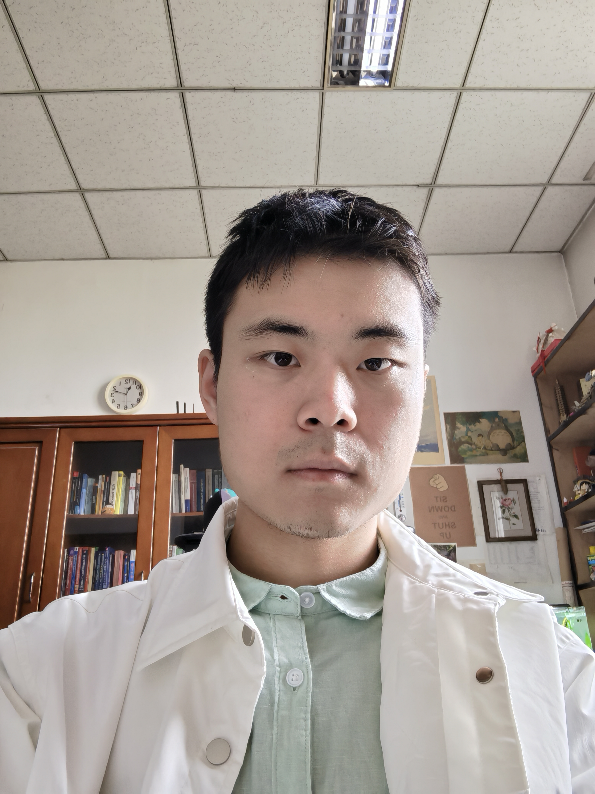

# About Me

Here is **Xinzhe Zhang (张信哲)**.

I am currently a 2ed-year graduate student in the department of physics at Nankai University, advised by [Prof. Chen](https://physics.nankai.edu.cn/cj/main.htm#:~:text=2008%E5%B9%B41).Before coming to Chen's group, I also graduated from the Nankai University with a B.S. in Physics.
My research interests lie in nanophonics and PT symmetric optics, and metasurfaces.

If you are interested in any aspect of me, I am always open to discussions and collaborations. Feel free to cantact me.

---

## Research Interests

- Nanophotonics
- PT symmetric optics
- Metasurfaces

My current research focuses on theoretical investigation of the electronic structure, transport and optical properties of nanostructures using analytical methods such as Finite-Difference Time-Domain (FDTD), and Finite Element Method (FEM). I am also interested in optimization and application of nanofabricated photonic devices. In a word, the photonic devices will serve as the basis for constructing compact chip-scale optical systems for a variety of functionalities including optical communications, sensing, imaging, spectroscopy. I wish to devote my talent to this meaningful cause and bring well-being to society.

---

## News and Updates

- **Oct 2023：** Very excited to win the National Scholarship!(only one)
- **Oct 2022：** Our paper on PT symmetric coupled waveguides got accepted to Optic Express!

 > **I am seeking a PhD position 2025 (@zxzzhe).**
